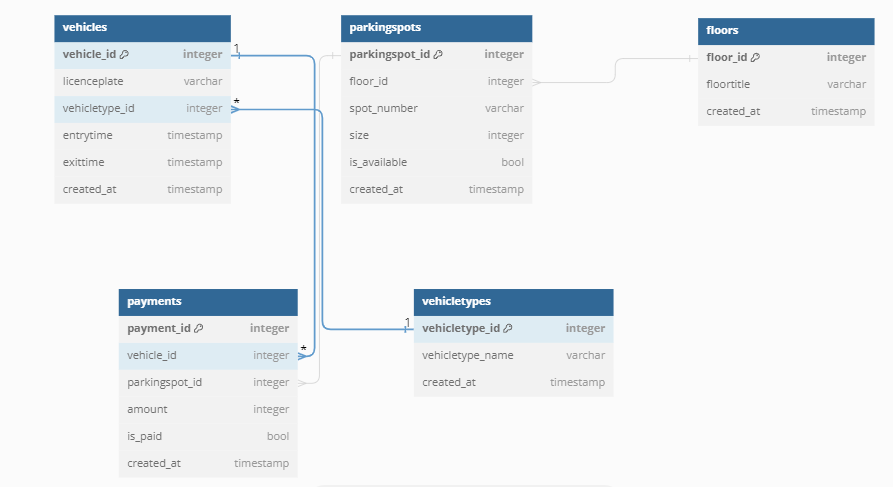

# DesignParkingLotSystem
low-level architecture for a backend system of a smart parking lot
# 1. Database Model
#
Table vehicles { 
  vehicle_id integer [primary key] 
  licenceplate varchar 
  vehicletype_id integer 
  entrytime timestamp 
  exittime timestamp 
  created_at timestamp 
} 
# 
Table parkingspots { 
  parkingspot_id integer [primary key] 
  floor_id integer 
  spot_number varchar 
  size integer 
  is_available bool 
  created_at timestamp 
} 
# 
Table floors { 
  floor_id integer [primary key] 
  floortitle varchar 
  created_at timestamp 
} 
# 
Table vehicletypes { 
  vehicletype_id integer [primary key] 
  vehicletype_name varchar 
  created_at timestamp 
} 
# 
Table payments { 
  payment_id integer [primary key] 
  vehicle_id integer 
  parkingspot_id integer 
  amount integer 
  is_paid bool 
  created_at timestamp 
} 

